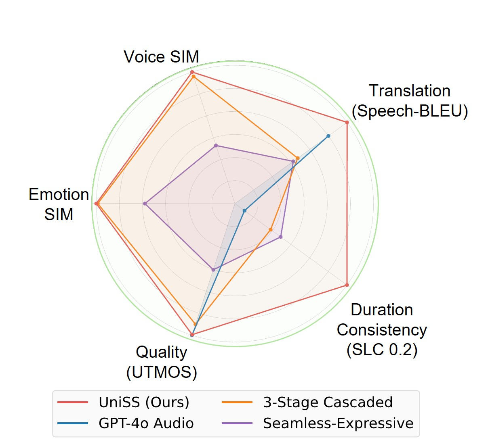
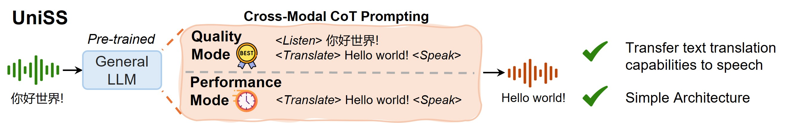
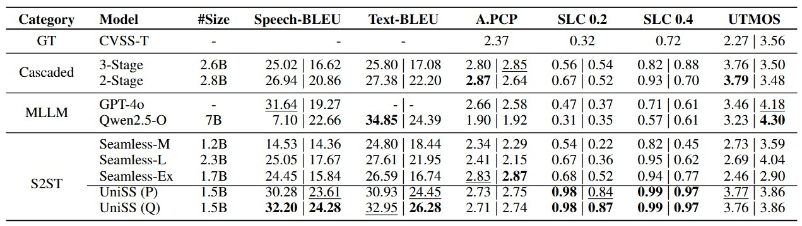
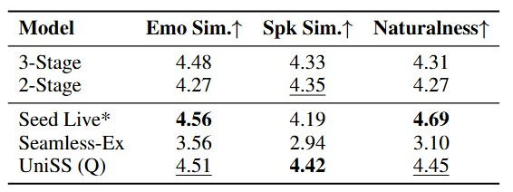

# <center>UniSS: Unified Expressive Speech-to-Speech Translation with Your Voice</center> 

## Overview
UniSS is a unified single-stage speech-to-speech translation (S2ST) framework that achieves high translation fidelity and speech quality, while preserving timbre, emotion, and duration consistency.

<a href="https://arxiv.org/"></a>
<a href="https://cmots.github.io/uniss.github.io/"></a>
<a href="https://huggingface.co/cmots/UniSS"></a>
<!-- <a href="https://github.com/cmots/UniSS"></a>
<a href="https://github.com/cmots/UniSS"></a>
<a href="https://github.com/cmots/UniSS"></a>
<a href="https://github.com/cmots/UniSS"></a> -->

UniSS has the following features:
- **High translation fidelity**: UniSS is constructed upon a pre-trained [Qwen2.5-1.5B-Instruct](https://huggingface.co/Qwen/Qwen2.5-1.5B-Instruct). It effectively transfers translation capabilities from large language models (LLMs) to the speech domain. 
- **Expressive translation**: UniSS preserves speaker voice, emotional style, and duration consistency.
- **Single-stage and unified**: UniSS uses only one language model to handle both text and speech, eliminating the need for additional generation models such as non-autoregressive models or flow matching models.
- **Efficient-Quality tradeoff**: UniSS supports a selection of tasks, including Quality mode and Performance mode. Performance mode can achieve up to 1.07x speedup with minimal reduction in speech fidelity. Additionally, we provide a smaller 0.5B version for low-resource scenarios.

### Performance
UniSS outperforms both end-to-end S2ST systems and cascaded systems on translation fidelity, expressiveness preservation, duration consistency and speech quality.



### Inference Modes
UniSS supports Quality mode and Performance mode for deployment in various scenarios.



### Supported Languages
UniSS supports English and Chinese.

## Installation
### Environment Setup
```bash
conda create -n uniss python=3.10.16
conda activate uniss
git clone https://github.com/cmots/UniSS.git
cd UniSS
pip install -r requirements.txt
# If you are in mainland China, you can set the mirror as follows:
pip install -r requirements.txt -i https://mirrors.aliyun.com/pypi/simple/ --trusted-host=mirrors.aliyun.com
```
### Model Download
The weight of UniSS is on [HuggingFace](https://huggingface.co/cmots/UniSS). 

You have to download the model manually, you can download it via provided script:
``` 
python download_weight.py
```

or download via git clone:
``` bash
mkdir -p pretrained_models

# Make sure you have git-lfs installed (https://git-lfs.com)
git lfs install

git clone https://huggingface.co/cmots/UniSS pretrained_models/UniSS
```

## Quick Start
See `infer.py` for an example to translate a single speech audio file. You need to set the `model_path` to the path of the model.
The target language must be set to `<|eng|>` for English output or `<|cmn|>` for Chinese output.
```bash
python infer.py
```

## vLLM Example
To support efficient inference with vllm, we provide the `vllm_example.py` script to translate multiple speech audio files.

0. Install vLLM.
```bash
conda activate uniss
# We tested vllm==0.8.0, and it works well.
pip install vllm==0.8.0 --no-deps
```
1. Modify the model path in `configs/uniss.yaml` if needed.
2. Run the example in Quality mode:
```bash
python vllm_example.py --task Quality --target_language zh \
    --input_path /path/to/input \
    --output_path /path/to/output
```

## Performance

### Metrics
1. Translation Fidelity: Speech-BLEU and Text-BLEU, higher is better.
2. Prosody Preservation: A.PCP, higher is better.
3. Duration Consistency: SLC 0.2 and SLC 0.4, higher is better.
4. Speech Quality: UTMOS, higher is better.

### Objective Results
The results is evaluated on the [CVSS-T test set](https://arxiv.org/pdf/2201.03713). UniSS acheives the best performance on translation fidelity, even surpassing the large multi-modal language models (GPT-4o-audio and Qwen2.5-Omni). UniSS demonstrates superior duration consistency, it achieves near-optimal SLC scores on English-to-Chinese direction. Moreover, UniSS achieves competitive speech quality with MLLM, and outperforms other S2ST models.



*Main comparison results on the CVSS-T dataset. Results are presented as EN-ZH | ZH-EN. Higher scores indicate better performance. ‘-’ denotes unavailable results. Best scores are in **bold** and second-best scores are underlined.*

### Subjective Results

We also evaluate the performance of UniSS on two expressive emotion datasets. UniSS outperforms other open-source S2ST models on voice similarity, emotion similarity and speech naturalness. UniSS is also competitive with the closed-source enterprise-level system [Seed LiveInterpret 2.0](https://arxiv.org/pdf/2507.17527).



*Subjective MOS evaluation on the expressive emotion dataset. Seed Live is a closed model. Best scores are in bold.*

## UniST: A Large-scale English-Chinese S2ST Dataset

We synthesize a large-scale English-Chinese S2ST dataset, which contains 44.8k hours of paired speech data and 19.8k hours of high-quality data. We are checking and reformatting the dataset for better open-source accessibility. 


## Citation
If you find our paper and code useful in your research, please consider giving a star and citation.
```bibtex

```